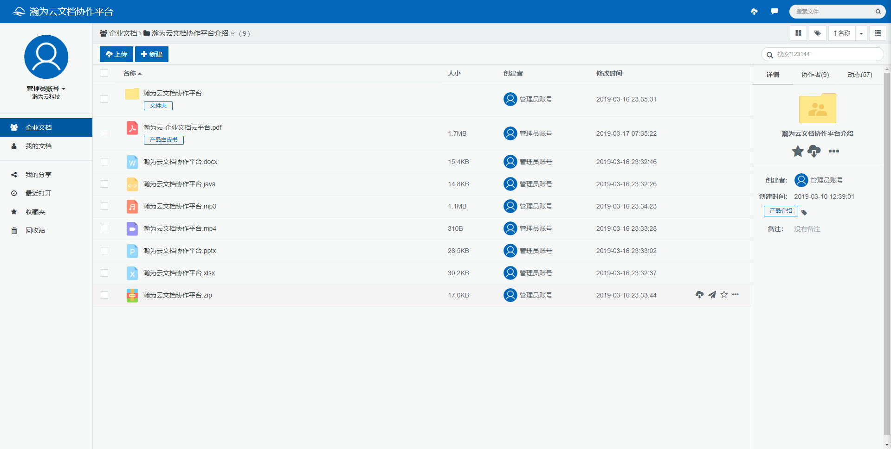
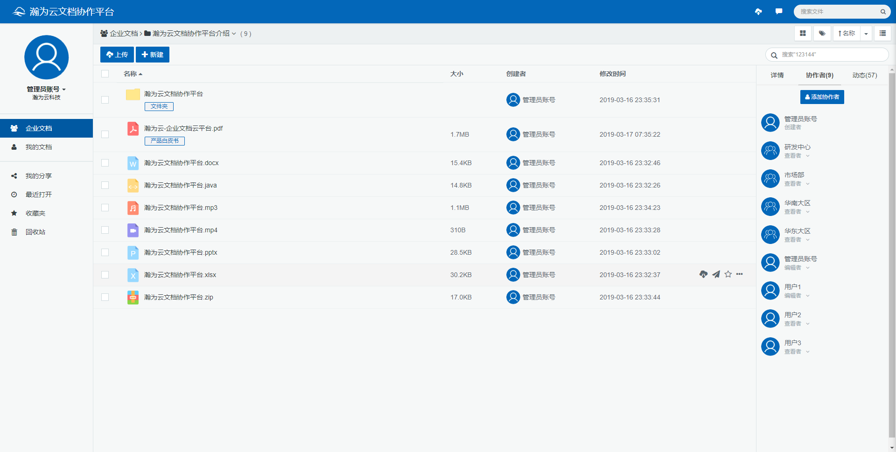
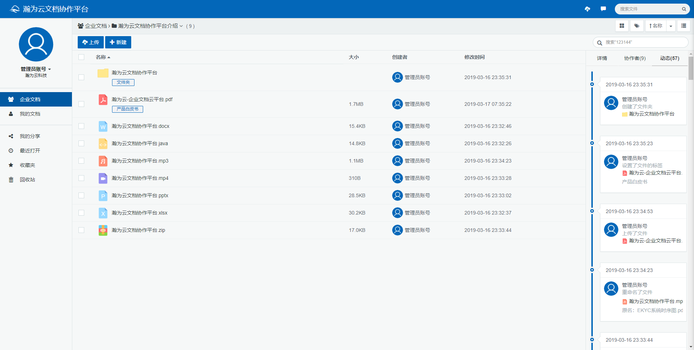
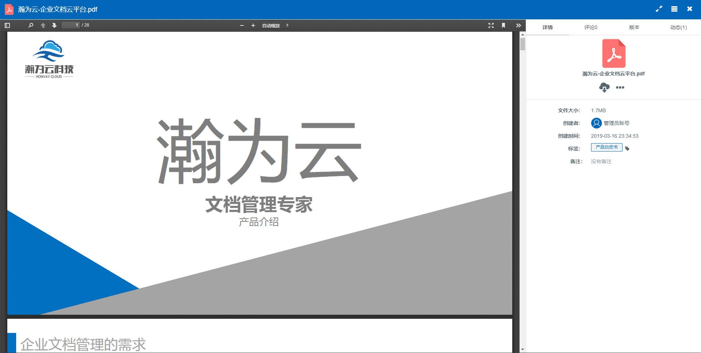
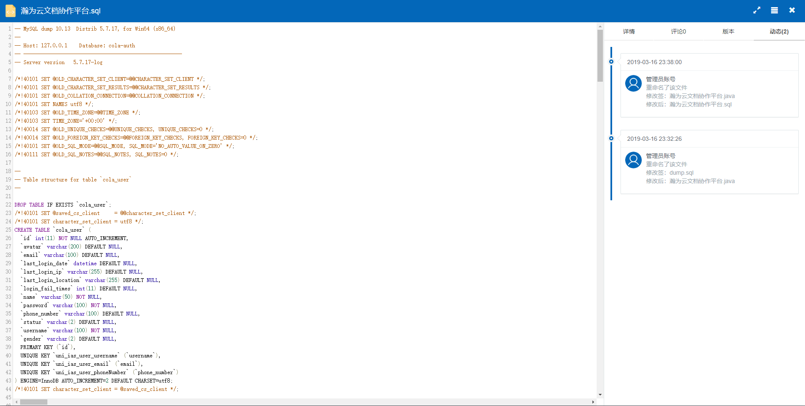
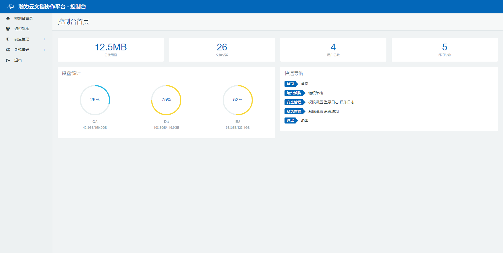
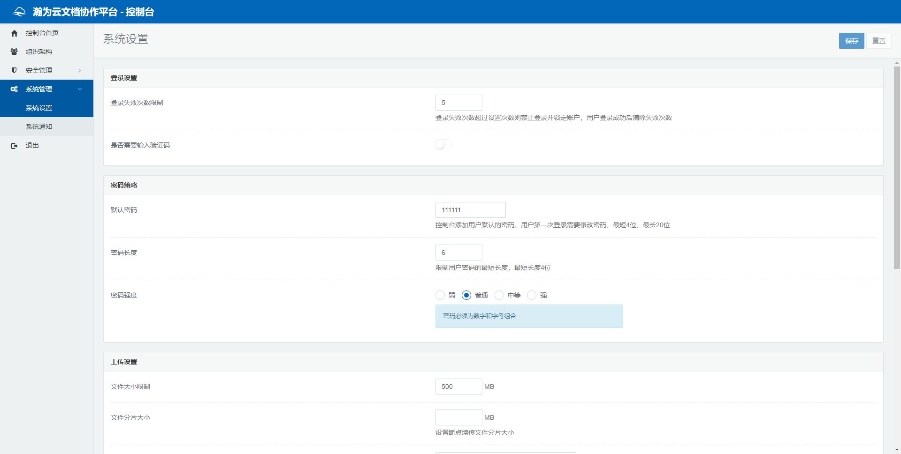

# 瀚为云文档协作平台（社区版）

#### 介绍
瀚为云文档协作平台([www.honvay.com](https://gitee.com/enterprises))是由南昌瀚为云科技有限责任公司开发的一款面向企业的文档协作平台，着力于满足企业文档管理中统一管理、安全存储、共享协作、权限控制等需求。

瀚为云文档协作平台提供文档存储平台，支持企业文件、个人文件等文件分库管理，并提供文件收藏夹、最近打开的文件、回收站等分区设置。平台能够满足统一存储、共享协作、权限控制功能。并提供文件上传、目录维护、重命名、移动、复制、设置标签、锁定、删除、预览、动态跟踪等功能。

瀚为云文档协作平台企业控制台提供组织架构管理、人员管理、登录日志、审计日志、系统设置、系统报表等功能。

#### 技术选型

- 主框架：SpringBoot2、SpringSecurity
- 持久层：MyBatisPlus
- 数据库：MySQL
- 前端UI：Angular、Bootstrap

#### 快速启动

- 环境准备：JDK 1.8、Maven 3.3、MySQL 5.7
- 下载源码：https://gitee.com/honvay/hdms-community.git
- 初始化数据库：sql/hdms-community.sql
- 修改配置：hdms-assembly/src/main/resources/application.yml 配置JDBC连接
- 启动应用：com.honvay.hdms.Application
- 浏览器访问：http://localhost:8090 账号 admin 密码 111111

#### 系统截图

#### 版权协议声明
- 本项目版权归南昌瀚为云科技有限公司所有，所有开源源码采用AGPL-3.0授权协议。

#### 沟通交流
- QQ群：**692741896**
- 官网: [www.honvay.com](wwww.honvy.com)